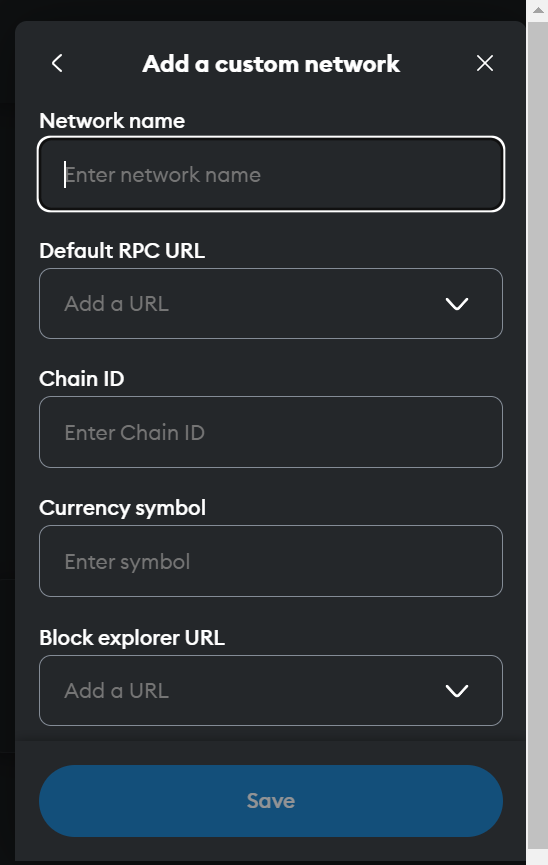
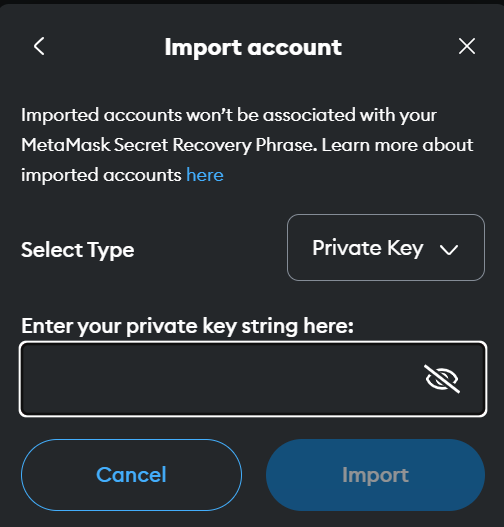

# NTUSwap - Decentralized Exchange

Our Decentralized Exchange is a secure, on-chain trading platform that enables peer-to-peer trading of ERC20 tokens without the need for intermediaries. Built on Ethereum, it implements an order book model providing users with traditional exchange functionalities in a decentralized manner.

## Demo

[](https://www.youtube.com/watch?v=fI01RsQn7iA)

## Prerequisites

<ul>
  <li>Truffle v5.11.5 (core: 5.11.5)</li>
  <li>Ganache v7.9.1</li>
  <li>Solidity - 0.8.20 (solc-js)</li>
  <li>Node v22.2.0</li>
  <li>Web3.js v1.10.0</li>
</ul>

## Steps to run the project

1. Clone the repository:

```
git clone <repository-url>
cd <project-directory>
```

2. Install dependencies:

```
npm install
```

3. Install Truffle:

```
npm install -g truffle
```

4. Install Ganache and run it in the terminal on port 8545:

```
npm i ganache
ganache
```

5. Run migrations and `migrate.sh` file

```
truffle compile
chmod +x migrate.sh
./migrate.sh
```

6. Install all frontend dependencies:

```
cd frontend
npm install
```

7. Run the frontend

```
npm run dev
```

8. Add local Ganache chain to Metamask. (RPC URL: http://127.0.0.1:8545, Chain ID: 1337)
   

9. Import the private key of account1 (owner) and account3 (user2) into Metamask.
   
10. Click "Connect Wallet" on the landing page.
